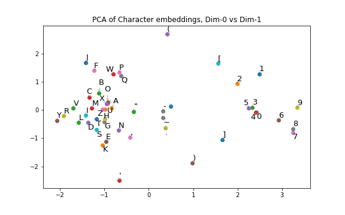
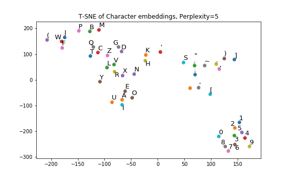

# Char2Vec
Character embedding following word-vector Word2Vec. (Work-in-progress)

---

### Result after training on a small corpus of a single Wikipedia page:

The model naturally learn to group characters into:
- Digits `0-9`;
- Alphabet `A-Z`;
- Left brackets `(,[` vs right brackets `),]`.

Note that `1` and `9` are quite distinct from other digits because years such as `"19XX"` appears quite often in the corpus.

---

More subtle grouping like vowels vs consonants can also be learned at the same time:
- Notice `A,E,I,O,U` hanging out in their own group, with `Y` trying to join the club.

---

Note:

* This repo is aiming for code clarity instead of fast performance
